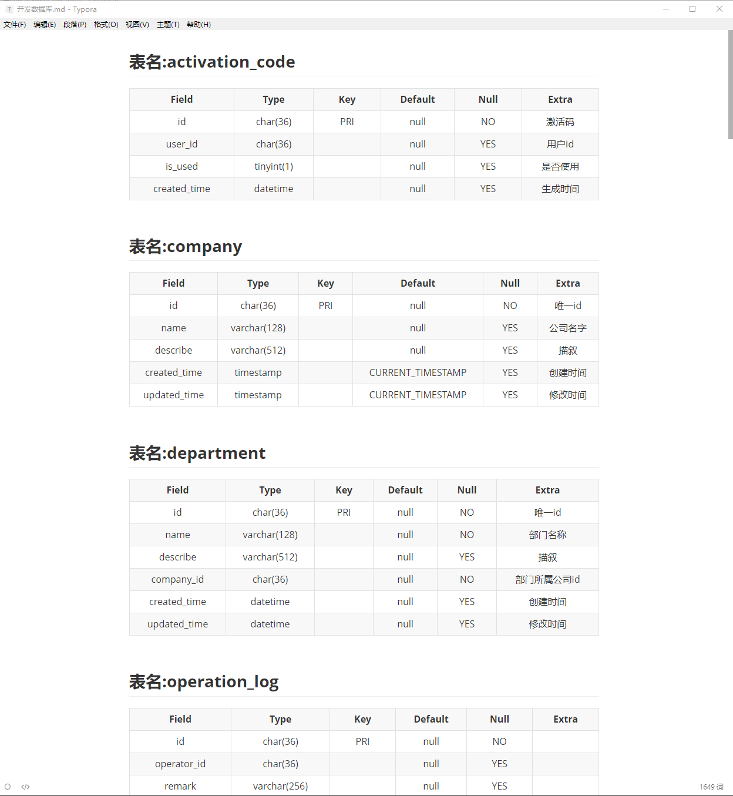
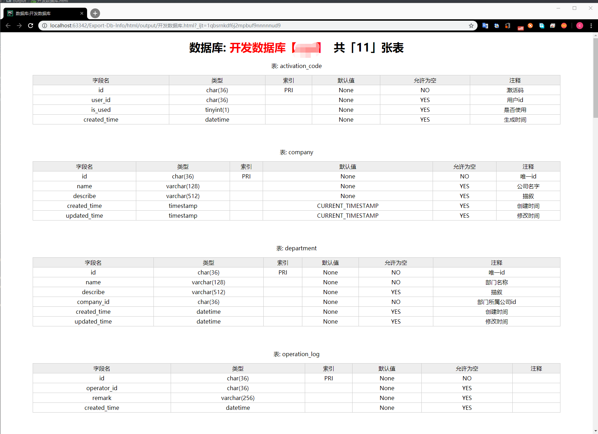

# Export-Db-Info
## 获取数据库表结构信息 并输出到markdown/html/pdf
## TODO 输出pdf待实现
## 输出数据库表ddl到文件

## 用法
* ### 下载本项目

         git clone https://github.com/superman-wrdh/Export-Db-Info.git

* ### 修改db.yaml中数据库信息，改成你自己的数据库

* ### 安装依赖
         pip3 install -r requirement.txt
 
* ### 运行
         python main.py -t html
 
         -t 参数 可选为html/markdown/pdf/ddl

## 输出markdown 效果如下

## 输出html效果如下
